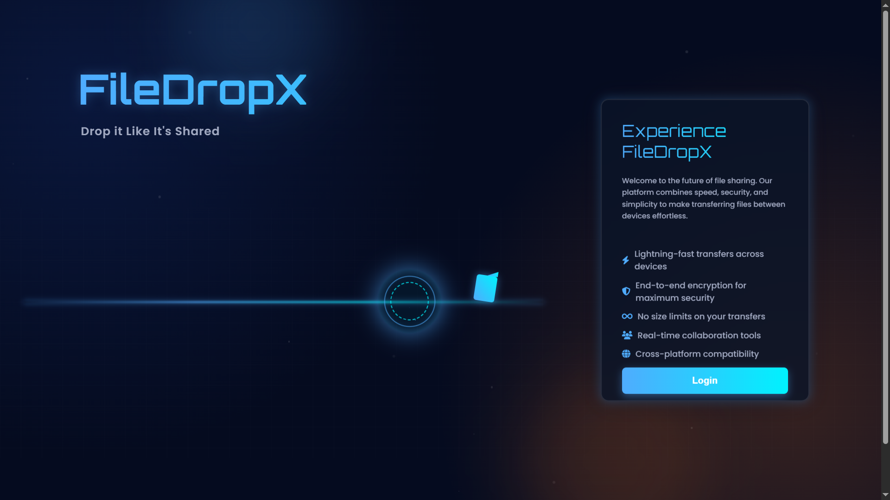
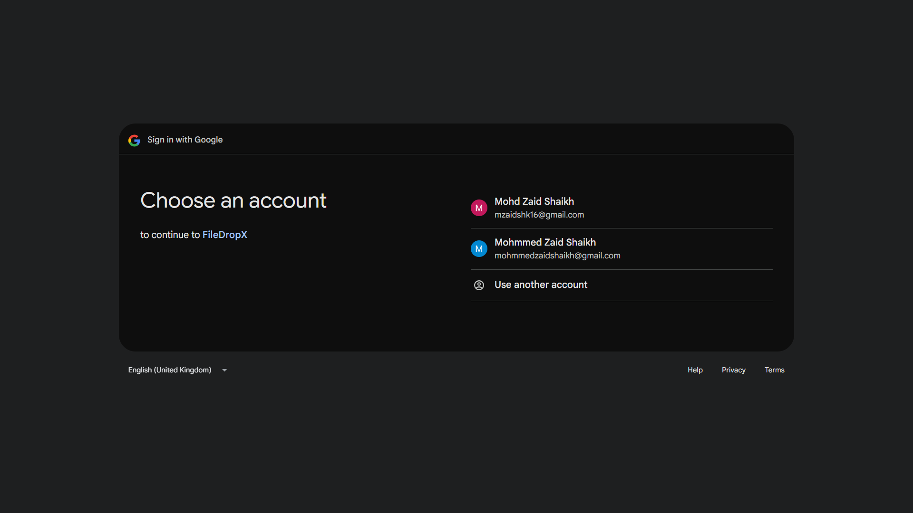

# FileDropX
## Drop It Like It's Shared

## 🚀 Overview

FileDropX is a cutting-edge file-sharing application that revolutionizes how users transfer files. Built with security, speed, and simplicity at its core, FileDropX enables seamless file uploads and sharing through unique, time-limited links. The platform features robust OAuth2 authentication with Google and GitHub integration, ensuring both convenience and security.

## ✨ Key Features

### 🔥 **Lightning-Fast Transfers**
Files are delivered directly from our optimized servers, ensuring maximum transfer speeds across all devices.

### 🔒 **Bank-Level Security**
- End-to-end encryption for maximum data protection
- Unique sharing links with automatic 24-hour expiration
- Secure OAuth2 authentication with major providers

### 📱 **Universal Compatibility**
- Cross-platform support (Windows, macOS, Linux, Mobile)
- No file size restrictions - share anything, anywhere
- QR code generation for instant mobile sharing

### 🛠️ **Advanced Features**
- Real-time collaboration tools
- Persistent file storage with automatic cleanup
- Intuitive drag-and-drop interface
- Multiple authentication methods

---

## 📸 Application Screenshots

### 🏠 Welcome Screen & Authentication
<div align="center">
  
  <p><em>Clean, modern landing page with feature highlights and easy login access</em></p>
</div>

### 📤 File Upload Interface
<div align="center">
  
  <p><em>Intuitive drag-and-drop upload experience with real-time user feedback</em></p>
</div>

### 🔐 OAuth Authentication
<div align="center">
  
  <p><em>Complete sharing solution with unique links, QR codes, and download options</em></p>
</div>

### 🔗 File Sharing Dashboard
<div align="center">
  
  <p><em>Seamless Google OAuth2 integration for secure, hassle-free authentication</em></p>
</div>

---

## 🛠️ Technology Stack

<table>
<tr>
<td><strong>Backend Framework</strong></td>
<td>Spring Boot 3.x - Enterprise-grade Java application framework</td>
</tr>
<tr>
<td><strong>Security</strong></td>
<td>Spring Security + OAuth2 - Comprehensive authentication and authorization</td>
</tr>
<tr>
<td><strong>Database</strong></td>
<td>MySQL + Spring Data JPA/Hibernate - Robust data persistence layer</td>
</tr>
<tr>
<td><strong>Frontend</strong></td>
<td>Thymeleaf - Server-side templating with modern UI components</td>
</tr>
<tr>
<td><strong>Runtime</strong></td>
<td>Java 17 - Latest LTS version with enhanced performance</td>
</tr>
</table>

---

## 🚀 Quick Start Guide

### 📋 Prerequisites

Ensure you have the following installed on your system:

- **Java Development Kit (JDK) 17+**
- **Apache Maven 3.6+**
- **MySQL Server 8.0+** (or cloud MySQL instance)
- **Git** for version control

### 1️⃣ Repository Setup

```bash
# Clone the repository
git clone https://github.com/Mohmmed-Zaid/FileDropX.git
cd FileDropX
```

### 2️⃣ Database Configuration

Create a MySQL database and user:

```sql
CREATE DATABASE filedropx_db;
CREATE USER 'filedropx_user'@'localhost' IDENTIFIED BY 'your_secure_password';
GRANT ALL PRIVILEGES ON filedropx_db.* TO 'filedropx_user'@'localhost';
FLUSH PRIVILEGES;
```

### 3️⃣ Application Properties Setup

Configure `src/main/resources/application.properties`:

```properties
# Database Configuration
spring.datasource.url=jdbc:mysql://localhost:3306/filedropx_db?useSSL=true&serverTimezone=UTC&allowPublicKeyRetrieval=true
spring.datasource.username=filedropx_user
spring.datasource.password=your_secure_password

# Hibernate Configuration
spring.jpa.hibernate.ddl-auto=update
spring.jpa.show-sql=true
spring.jpa.properties.hibernate.format_sql=true

# OAuth2 Configuration
spring.security.oauth2.client.registration.google.client-id=${GOOGLE_CLIENT_ID}
spring.security.oauth2.client.registration.google.client-secret=${GOOGLE_CLIENT_SECRET}
spring.security.oauth2.client.registration.google.redirect-uri=${BASE_URL}/login/oauth2/code/google

spring.security.oauth2.client.registration.github.client-id=${GITHUB_CLIENT_ID}
spring.security.oauth2.client.registration.github.client-secret=${GITHUB_CLIENT_SECRET}
spring.security.oauth2.client.registration.github.redirect-uri=${BASE_URL}/login/oauth2/code/github

# Application Settings
BASE_URL=http://localhost:8080
server.port=8080

# Admin Configuration
admin.username=${ADMIN_USERNAME:admin}
admin.password=${ADMIN_PASSWORD:changeme}

# Environment Profile
spring.profiles.active=dev
```

### 4️⃣ Environment Variables

Set the following environment variables:

```bash
export GOOGLE_CLIENT_ID="your_google_client_id"
export GOOGLE_CLIENT_SECRET="your_google_client_secret"
export GITHUB_CLIENT_ID="your_github_client_id"
export GITHUB_CLIENT_SECRET="your_github_client_secret"
export ADMIN_USERNAME="your_admin_username"
export ADMIN_PASSWORD="your_strong_admin_password"
```

### 5️⃣ OAuth Provider Configuration

#### Google OAuth Setup:
1. Visit [Google Cloud Console](https://console.cloud.google.com/)
2. Navigate to **APIs & Services > Credentials**
3. Create/Edit OAuth 2.0 Client ID
4. Add authorized redirect URI: `http://localhost:8080/login/oauth2/code/google`

#### GitHub OAuth Setup:
1. Go to **GitHub Settings > Developer settings > OAuth Apps**
2. Create/Edit your OAuth application
3. Set authorization callback URL: `http://localhost:8080/login/oauth2/code/github`

### 6️⃣ Launch Application

```bash
# Run the application
mvn spring-boot:run

# Or build and run JAR
mvn clean package
java -jar target/filedropx-*.jar
```

🎉 **Access your application at:** `http://localhost:8080`

---

## 📁 Project Structure

```
FileDropX/
├── src/
│   ├── main/
│   │   ├── java/
│   │   │   └── com/filedropx/
│   │   │       ├── config/          # Security & OAuth configuration
│   │   │       ├── controller/      # REST controllers
│   │   │       ├── model/           # JPA entities
│   │   │       ├── repository/      # Data access layer
│   │   │       └── service/         # Business logic
│   │   └── resources/
│   │       ├── static/              # CSS, JS, images
│   │       ├── templates/           # Thymeleaf templates
│   │       └── application.properties
├── screenshots/                     # Application screenshots
├── pom.xml                         # Maven dependencies
└── README.md                       # Project documentation
```

---

## 🤝 Contributing

We welcome contributions from the community! Here's how you can help:

### 🔄 Development Workflow

1. **Fork** the repository
2. **Create** a feature branch (`git checkout -b feature/amazing-feature`)
3. **Commit** your changes (`git commit -m 'Add amazing feature'`)
4. **Push** to the branch (`git push origin feature/amazing-feature`)
5. **Open** a Pull Request

### 🐛 Bug Reports

Found a bug? Please create an issue with:
- Detailed description
- Steps to reproduce
- Expected vs actual behavior
- Environment details

### 💡 Feature Requests

Have an idea? We'd love to hear it! Open an issue with the `enhancement` label.

---

## 📄 License

This project is licensed under the **MIT License** - see the [LICENSE](LICENSE) file for details.

---

## 🙏 Acknowledgments

- Spring Boot community for the excellent framework
- OAuth2 providers for secure authentication
- All contributors who help improve FileDropX

---

<div align="center">
  <h3>Made with ❤️ by the FileDropX Team</h3>
  <p>
    <a href="https://github.com/Mohmmed-Zaid/FileDropX">⭐ Star this project</a> |
    <a href="https://github.com/Mohmmed-Zaid/FileDropX/issues">🐛 Report Bug</a> |
    <a href="https://github.com/Mohmmed-Zaid/FileDropX/issues">💡 Request Feature</a>
    <a href="https://mohmmedzaid-portfolio.netlify.app/">Portfolio</a>
  </p>
</div>
